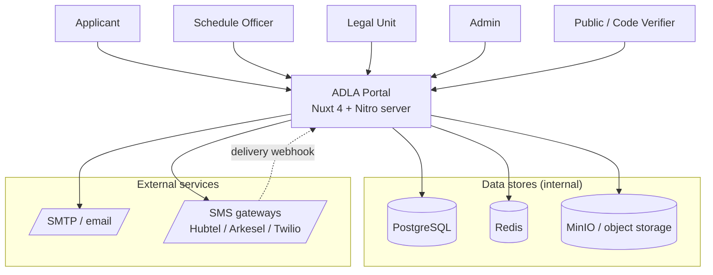
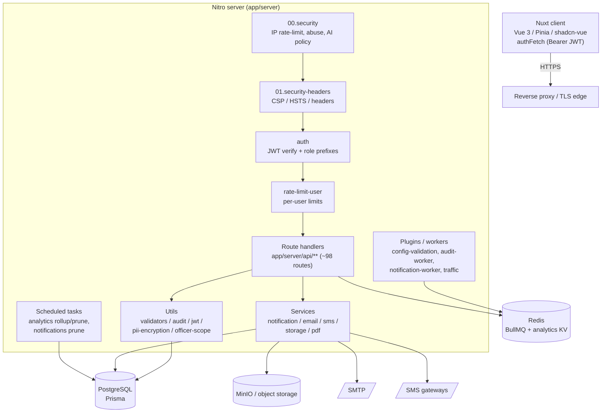
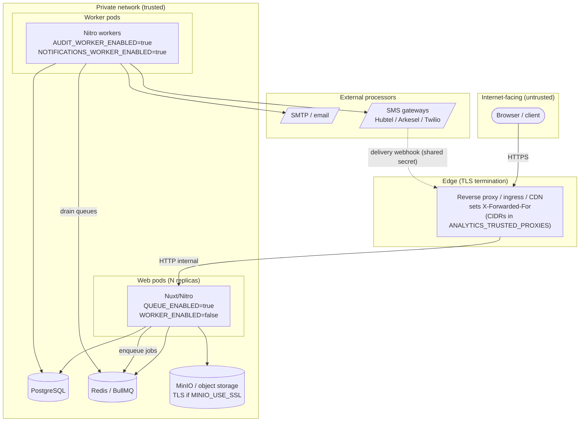
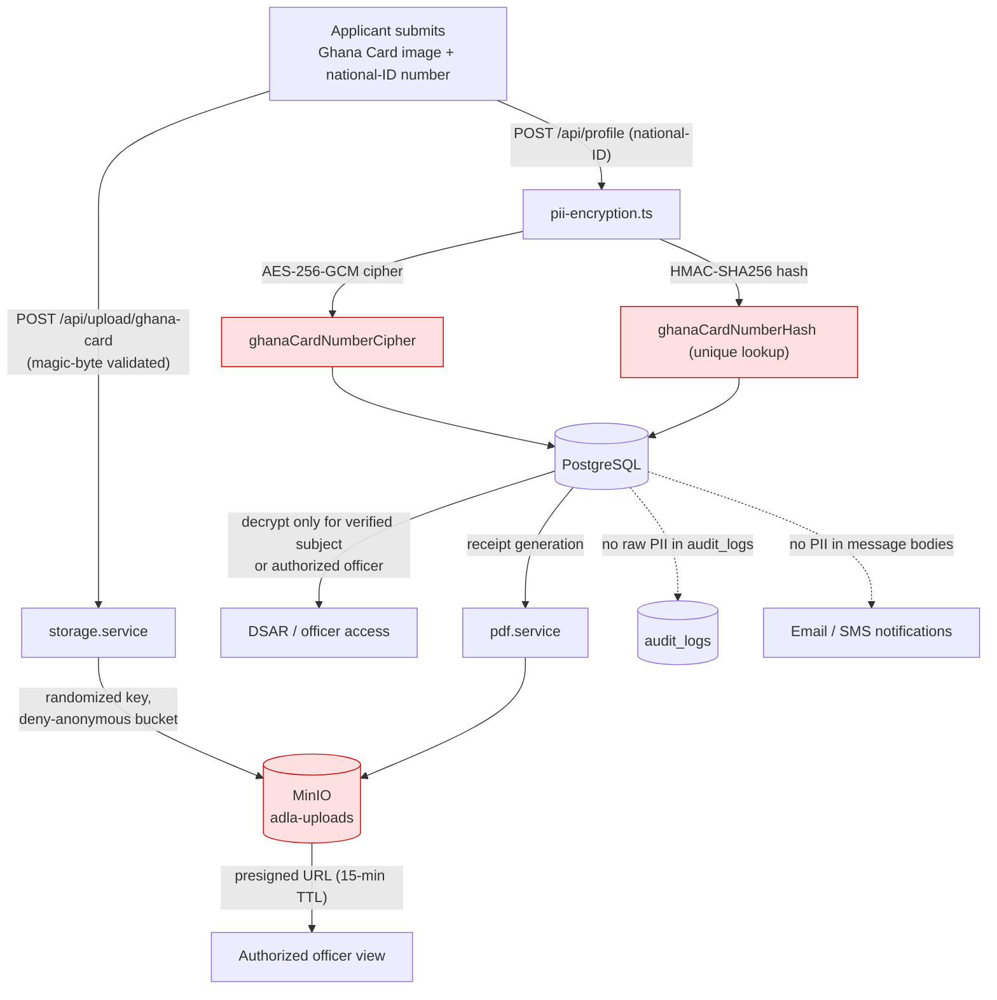
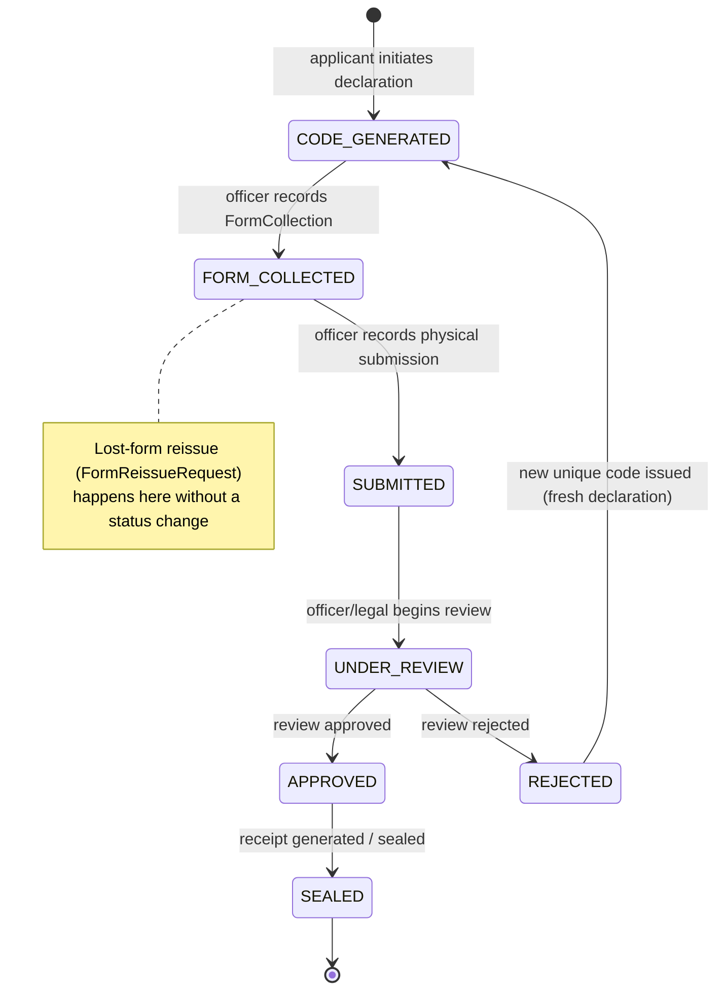

# System Architecture — Asset Declaration Portal (ADLA)

> Auditor-facing architecture overview. Closes audit-checklist items **D1**
> (system architecture, logical + deployment), **D2** (network/infrastructure
> topology), and **C5** (PII data-flow). Grounded in the codebase; the
> engineering reference is `CLAUDE.md`, deploy details in
> `docs/production-checklist.md`, security analysis in
> `docs/security-assessment.md`.
>
> **Diagrams** are shown inline as Mermaid (renders on GitHub) and exported as
> SVG under [`docs/diagrams/`](./diagrams/) for offline viewing.

**Document control:** Version 0.1 (draft) · Owner `[TBD]` (ISO / Engineering
lead) · Reviewed 2026-06-03 · Living reference derived from the codebase —
update on significant architecture change.

---

## 1. Overview

ADLA is a single **Nuxt 4** application (`app/`) — a Vue 3 client plus a Nitro
server (frontend + API in one deployable). It digitizes Ghana's Article 286(5)
asset-declaration workflow for four actor roles (`applicant`,
`schedule_officer`, `legal_unit`, `admin`). It processes Restricted-PII
(national-ID numbers, Ghana Card images) and is internet-facing, so security and
data-protection controls are first-class (see the policy suite indexed in
`docs/audit-documentation-checklist.md`).

## 2. System context

Who and what the system interacts with.

[SVG export »](./diagrams/system-context.svg)

## 3. Component / layered architecture

Requests pass through a deliberately ordered middleware pipeline before reaching
route handlers. Filenames enforce order (Nitro runs middleware
filename-sorted):

[SVG export »](./diagrams/component-architecture.svg)

**Middleware pipeline** (`app/server/middleware/`):

| Order | File | Role |
| --- | --- | --- |
| 1 | `00.security.ts` | IP-scoped: operator allow/block rules, AI-crawler policy, per-IP & per-route-group rate limits, abuse enforcement. Runs first so floods are rejected before JWT work. |
| 2 | `01.security-headers.ts` | CSP (report-only by default), HSTS, X-Frame-Options, X-Content-Type-Options, Referrer-Policy, Permissions-Policy. |
| 3 | `auth.ts` | Verifies Bearer JWT, sets `event.context.auth`, enforces role prefixes (`/api/admin`→admin, `/api/officer`→officer/admin, `/api/legal`→legal/admin). |
| 4 | `rate-limit-user.ts` | Per-authenticated-user limits (needs `event.context.auth`). |

All three security middleware **fail open on internal errors** (intentional
403/429 still propagate) so a transient fault can't lock the system. Authorization
decisions themselves do not fail open.

**Services** (`app/server/services/`) — route handlers call these rather than
talking to providers directly: `notification.service` (fans out to
`email.service` / `sms.service`, writes delivery logs), `storage.service`
(MinIO), `pdf.service` (receipts via pdf-lib).

## 4. Deployment topology & trust boundaries

Production runs as **web pods** (serve traffic, enqueue jobs) and **worker
pods** (drain BullMQ queues), split by the `*_WORKER_ENABLED` flags. Data
stores and external processors sit in the trusted network; only the reverse
proxy is internet-facing.

[SVG export »](./diagrams/deployment-topology.svg)

**Trust boundaries:**

| Zone | Components | Exposure |
| --- | --- | --- |
| Untrusted | End-user browsers | Public internet |
| Edge | Reverse proxy / ingress / CDN (TLS termination) | Internet-facing; the only public entry |
| Trusted | Web pods, worker pods, PostgreSQL, Redis, MinIO | Private network only |
| External | SMTP, SMS gateways | Reached outbound by workers; SMS posts delivery webhooks inbound |

**Client-IP / proxy handling** (`app/server/utils/request-meta.ts`): the app
trusts `X-Forwarded-For` **only** from socket peers within
`ANALYTICS_TRUSTED_PROXIES` (CIDRs), parsing the chain right-to-left to return
the first untrusted hop. Empty list = trust only the socket peer. This prevents
IP spoofing of rate-limit/abuse/audit attribution. **TLS** applies at the public
edge and (when `MINIO_USE_SSL=true`) on the app→MinIO link.

## 5. PII data-flow (C5)

How Restricted-PII enters, is protected, and leaves the system.

[SVG export »](./diagrams/pii-data-flow.svg)

Controls on this flow: uploads are magic-byte validated and written with
randomized keys to a **deny-anonymous** bucket (access only via 15-minute
presigned URLs); national-ID values are **AES-256-GCM encrypted** with an
**HMAC-SHA256** lookup hash (`pii-encryption.ts`); raw PII is kept out of
`audit_logs`, exports, and notification bodies (see
`data-classification-policy.md`). Full classification and dictionary in
`docs/data-model.md`.

## 6. Declaration state machine

The core workflow `Declaration.status` drives. The applicant only initiates
(`CODE_GENERATED`); officers/legal drive every later transition.

[SVG export »](./diagrams/declaration-state-machine.svg)

## 7. Technology stack

| Layer | Technology |
| --- | --- |
| Frontend | Nuxt 4 (Vue 3, `compatibilityVersion: 4`), Pinia, shadcn-vue, Tailwind v4 |
| Server | Nitro (Nuxt server engine), TypeScript (strict) |
| ORM / DB | Prisma → PostgreSQL 16 |
| Cache / queues | Redis 7, BullMQ (notifications-email, notifications-sms, audit-logs), pub/sub for SSE |
| Object storage | MinIO / S3-compatible (`adla-uploads`) |
| Email / SMS | Nodemailer (SMTP); Hubtel / Arkesel (Ghana), Twilio (international) |
| Auth | JWT (access 15m / refresh 7d), bcrypt, refresh-token rotation |
| Crypto | AES-256-GCM + HMAC-SHA256 for PII at rest |

## 8. Cross-cutting concerns

- **Background workers** (`app/server/plugins/`): `00.config-validation`
  (secret startup gate — refuses to boot in prod with missing/placeholder
  secrets), `audit-worker` and `notification-worker` (BullMQ drains, run on
  worker pods), `traffic` (analytics capture on `afterResponse`, zero
  user-facing latency).
- **Scheduled tasks** (`app/server/tasks/`, configured in `nuxt.config.ts`):
  `analytics:rollup` (every 10 min), `analytics:prune` (daily 03:30),
  `notifications:prune` (daily 03:45).
- **State-change pattern**: validate auth → validate body (Zod via
  `validateBody`) → mutate via Prisma → write audit log (`createAuditLog`) →
  trigger notification. See `CLAUDE.md`.

## 9. Key architecture decisions

| Decision | Rationale |
| --- | --- |
| Durable, queue-backed audit + notification writes | Audit logging is a compliance requirement; BullMQ retries + failed-set survive pod restarts. |
| Web/worker pod split | Web pods stay responsive; workers absorb email/SMS/audit load. |
| Secret startup gate | Prevents committed placeholder secrets reaching production (SA C-1). |
| PII field encryption + HMAC lookup | Confidentiality at rest while still supporting uniqueness/equality queries. |
| Deny-anonymous bucket + presigned URLs | Prevents object-store leakage of Ghana Card images. |
| Trusted-proxy IP resolution | Prevents spoofed attribution in rate-limit/abuse/audit. |
| Fail-open security middleware (internal errors only) | A transient fault degrades gracefully rather than denying all traffic; authz still enforced. |

---

## Related documents

- API surface: [`api-inventory.md`](./api-inventory.md)
- Data model & dictionary: [`data-model.md`](./data-model.md)
- External interfaces: [`integration-control-documents.md`](./integration-control-documents.md)
- Topology config & secrets: [`production-checklist.md`](./production-checklist.md)
- Analytics/abuse subsystem: [`analytics-abuse-ratelimit.md`](./analytics-abuse-ratelimit.md)
