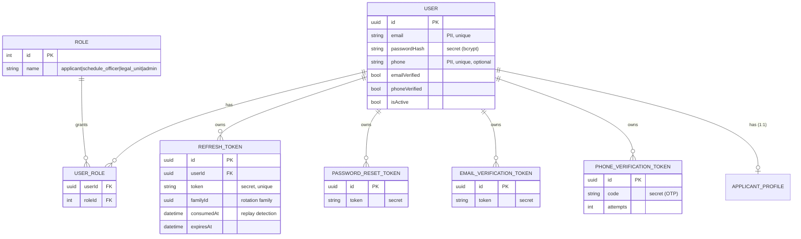
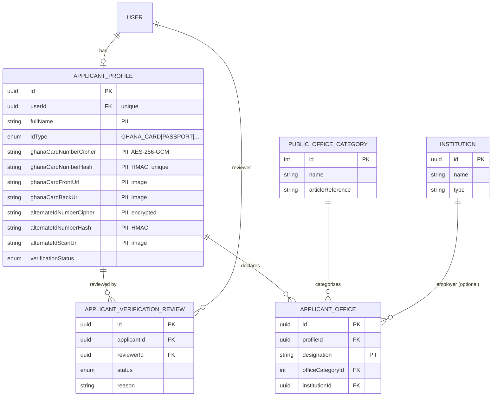
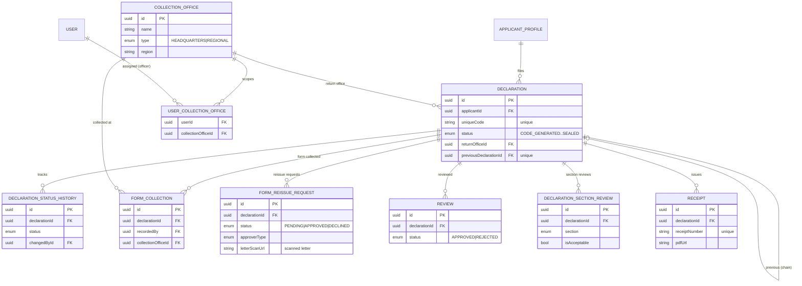
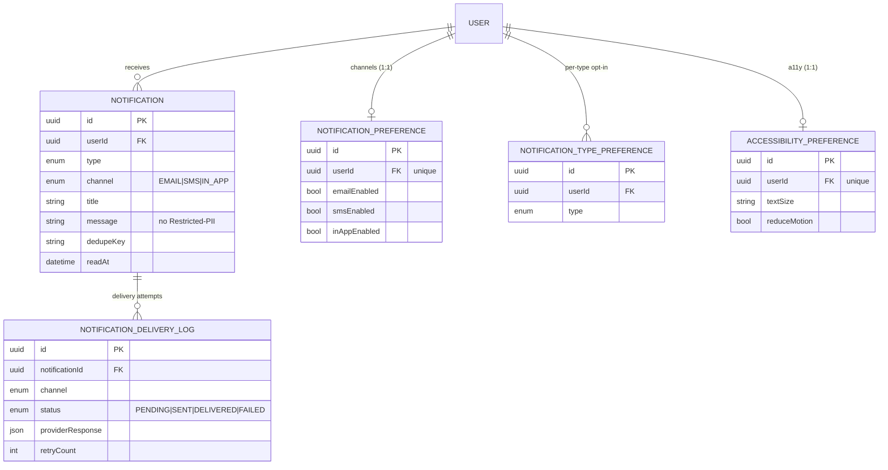
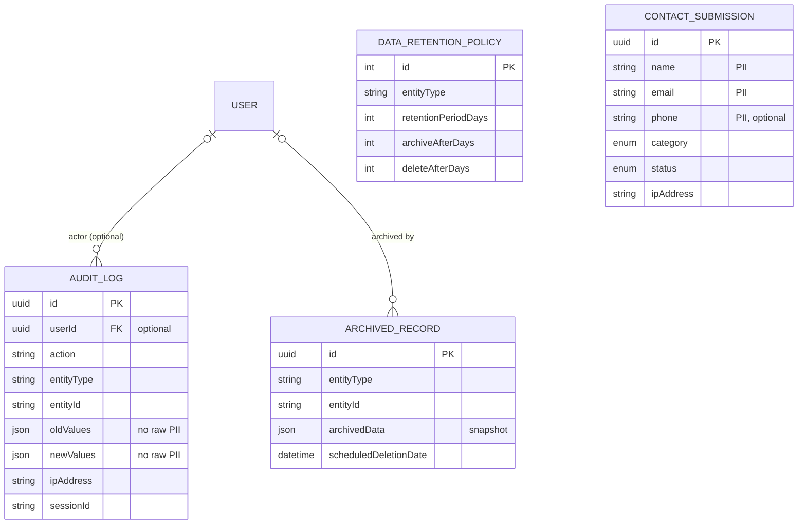
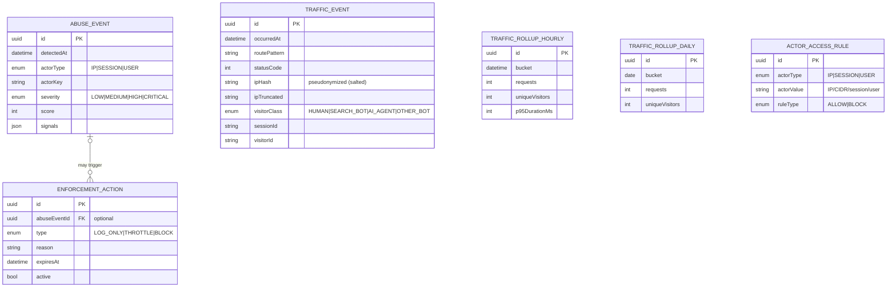

# Data Model — ERD & Data Dictionary — Asset Declaration Portal (ADLA)

> Closes audit-checklist item **D3**. Authoritative source is
> `app/prisma/schema.prisma` (camelCase Prisma fields map to snake_case Postgres
> columns via `@map`/`@@map`). Classification tiers reference
> [`data-classification-policy.md`](./data-classification-policy.md):
> **Restricted-PII**, **Confidential**, **Internal**, **Public**.
>
> ERDs are grouped by domain cluster. Each is inline Mermaid + an SVG export
> under [`docs/diagrams/`](./diagrams/). Only key fields are shown per entity;
> the data dictionary below each diagram flags sensitive columns.

---

## 1. Identity & Authentication

[SVG export »](./diagrams/erd-identity-auth.svg)

| Entity.field | Tier | Notes |
| --- | --- | --- |
| User.email, User.phone | Confidential (PII) | Unique; contact identifiers |
| User.passwordHash | Restricted (secret) | bcrypt hash, never returned |
| RefreshToken.token, *Token.token/code | Restricted (secret) | Session/verification secrets; `familyId`/`consumedAt` drive replay detection |
| Role.name, UserRole.* | Internal | RBAC reference data |

## 2. Applicant Profile & Verification

[SVG export »](./diagrams/erd-applicant-profile.svg)

| Entity.field | Tier | Notes |
| --- | --- | --- |
| ApplicantProfile.ghanaCardNumberCipher / Hash | **Restricted-PII** | National ID: AES-256-GCM cipher + HMAC lookup hash (`pii-encryption.ts`) |
| ApplicantProfile.alternateIdNumberCipher / Hash | **Restricted-PII** | Alternate ID, same scheme |
| ApplicantProfile.ghanaCardFrontUrl / BackUrl / alternateIdScanUrl | **Restricted-PII** | Identity-document images in MinIO (presigned access) |
| ApplicantProfile.fullName, ApplicantOffice.designation | Confidential (PII) | Name + declared public office |
| PublicOfficeCategory.*, Institution.* | Public / Internal | Reference data |

## 3. Declaration Workflow

[SVG export »](./diagrams/erd-declaration-workflow.svg)

| Entity.field | Tier | Notes |
| --- | --- | --- |
| Declaration.uniqueCode | Confidential | Identifier used for authenticity verification |
| Declaration.previousDeclarationId | Internal | Self-referential chain on rejection→reissue |
| UserCollectionOffice.* | Internal | Officer-to-office scoping (enforced by `officer-scope.ts`) |
| FormReissueRequest.letterScanUrl, Receipt.pdfUrl | Confidential | Documents in MinIO (presigned) |
| Declaration/Review/Section/History records | Confidential | Asset-declaration workflow data; long statutory retention |

## 4. Notifications & Preferences

[SVG export »](./diagrams/erd-notifications.svg)

| Entity.field | Tier | Notes |
| --- | --- | --- |
| Notification.title/message | Confidential | **Policy: no Restricted-PII in bodies** |
| NotificationDeliveryLog.providerResponse | Internal | Delivery metadata from email/SMS provider |
| *Preference.* , AccessibilityPreference.* | Internal | Per-user settings (a11y may be health-adjacent → Confidential) |

## 5. Audit, Retention & Contact

[SVG export »](./diagrams/erd-governance.svg)

| Entity.field | Tier | Notes |
| --- | --- | --- |
| AuditLog.oldValues / newValues | Confidential | **Policy: no raw Ghana Card numbers/names** (RR-04) |
| AuditLog.ipAddress, ContactSubmission.ipAddress | Confidential | Source IP (subject to trusted-proxy resolution) |
| ArchivedRecord.archivedData | Inherits source | Full entity snapshot for retention/deletion |
| ContactSubmission.name/email/phone | Confidential (PII) | Public enquiry data |

## 6. Analytics, Abuse & Access Control

[SVG export »](./diagrams/erd-analytics-abuse.svg)

| Entity.field | Tier | Notes |
| --- | --- | --- |
| TrafficEvent.ipHash / ipTruncated | Internal (pseudonymized) | IP salted-hashed via `ANALYTICS_IP_SALT`; raw IP not stored |
| TrafficEvent.sessionId / visitorId | Internal | Cookieless fingerprint identifiers |
| AbuseEvent / EnforcementAction / ActorAccessRule | Internal | Security operations; pruned per analytics retention |

> Full analytics/abuse design: [`analytics-abuse-ratelimit.md`](./analytics-abuse-ratelimit.md).

---

## 7. Enumerations (reference)

| Enum | Values |
| --- | --- |
| DeclarationStatus | CODE_GENERATED, FORM_COLLECTED, SUBMITTED, UNDER_REVIEW, APPROVED, REJECTED, SEALED |
| VerificationStatus | PENDING_VERIFICATION, VERIFIED, ON_HOLD, MORE_INFO_REQUIRED, REJECTED |
| FormReissueStatus | PENDING, APPROVED, DECLINED |
| ReissueApproverType | AUDITOR_GENERAL, REGIONAL_AUDITOR |
| IdDocumentType | GHANA_CARD, PASSPORT, VOTER_ID, DRIVERS_LICENSE, NIA_RECEIPT |
| AlternateIdReason | PENDING_NIA_REGISTRATION, FOREIGN_NATIONAL, LOST_AWAITING_REISSUE, DAMAGED_AWAITING_REISSUE, OTHER |
| ReviewStatus | APPROVED, REJECTED |
| FormSection | PERSONAL_PARTICULARS, PROPERTIES, EMPLOYMENT_BUSINESS, SECURITIES_BANK, ALIASES_PROPERTIES, LIABILITIES, VOLUNTARY_INFO, DECLARANT_CERTIFICATE |
| CollectionOfficeType | HEADQUARTERS, REGIONAL |
| NotificationType | UNIQUE_CODE_GENERATED, FORM_COLLECTED, FORM_RETURNED, FORM_REISSUE_* , SECTION_REVIEW_COMMENTS, REVIEW_APPROVED/REJECTED, RECEIPT_READY, PASSWORD_RESET, EMAIL_VERIFICATION, VERIFICATION_* |
| NotificationChannel | EMAIL, SMS, IN_APP |
| DeliveryStatus | PENDING, SENT, DELIVERED, FAILED |
| ContactCategory / ContactStatus | GENERAL_INQUIRY, TECHNICAL_SUPPORT, DECLARATION_HELP, FEEDBACK, COMPLAINT, OTHER / NEW, IN_PROGRESS, RESOLVED, CLOSED |
| VisitorClass / AiCategory | HUMAN, SEARCH_BOT, AI_AGENT, OTHER_BOT / TRAINING_CRAWLER, SEARCH_INDEXER, LIVE_RETRIEVAL, UNKNOWN_SCRAPER |
| AbuseSeverity / EnforcementType | LOW, MEDIUM, HIGH, CRITICAL / LOG_ONLY, THROTTLE, BLOCK |
| AccessActorType / AccessRuleType | IP, SESSION, USER / ALLOW, BLOCK |

---

*Generated from `app/prisma/schema.prisma`. Regenerate diagrams with the
`.mmd` sources in `docs/diagrams/`. See the build note in
[`architecture.md`](./architecture.md).*
