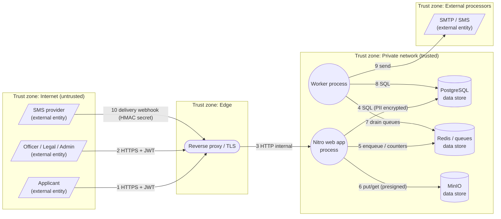

# STRIDE Threat Model — Asset Declaration Portal (ADLA)

> Closes audit-checklist item **G4**. A structured STRIDE analysis over ADLA's
> data-flow and trust boundaries. Complements the static
> [`security-assessment.md`](./security-assessment.md) (findings) and feeds the
> [`risk-register.md`](./risk-register.md) (RR-xx). Architecture context:
> [`architecture.md`](./architecture.md).

---

## 0. Document control

| Field | Value |
| --- | --- |
| Version | 0.1 (draft) |
| Owner | `[TBD]` (Information Security Officer) |
| Approved by | `[TBD]` |
| Date created | 2026-06-03 |
| Review cadence | On significant architecture change; at least annually; after major incidents. |
| Method | STRIDE per-element over a Level-0 data-flow diagram (DFD). |

---

## 1. Scope & methodology

**Scope:** the ADLA application (`app/`), its data stores (PostgreSQL, Redis,
MinIO), supporting processors (SMTP, SMS), and the edge. **In scope:**
application-layer threats, auth/authorization, PII handling, external
interfaces. **Out of scope (inherited):** physical/data-center controls
(provider attestation — SoA A.7), and end-user device security.

**Method:** decompose the system into a DFD (external entities, processes, data
stores, data flows, trust boundaries), then apply **STRIDE** — Spoofing,
Tampering, Repudiation, Information disclosure, Denial of service, Elevation of
privilege — to each element. Each threat records its **existing mitigation**,
**residual** standing, and a link to the risk register / assessment finding.

**Adversary model:** an internet attacker who has the source code, can register
applicant accounts, and may compromise a low-privilege staff account.

## 2. Data-flow diagram & trust boundaries

[SVG export »](./diagrams/threat-model-dfd.svg)

**Trust boundaries** (where data crosses a privilege level — primary threat
focus): **(B1)** Internet→Edge (flows 1,2,10); **(B2)** Edge→app (flow 3);
**(B3)** app/worker→data stores (flows 4–8); **(B4)** app/worker→external
processors (flows 9,10).

**Assets:** Restricted-PII (national-ID ciphers, Ghana Card images), credentials
& keys (JWT secrets, PII keys, MinIO/DB creds), declaration records & audit
trail, system availability.

## 3. STRIDE analysis

Residual key: **Low / Med / High** after the listed controls (consistent with
`risk-register.md`).

### 3.1 Spoofing (authenticity)

| ID | Threat | Element | Existing mitigation | Residual | Ref |
| --- | --- | --- | --- | --- | --- |
| S1 | Forged/guessed session to impersonate a user | Flows 1-2, WEB | Signed JWT (separate access/refresh secrets); refresh rotation + family **replay detection**; bcrypt; per-account lockout | Med | RR-05 |
| S2 | Credential stuffing / brute force | WEB (login) | Lockout (10/15min→60min); constant-time user-not-found; auth rate-limit (15/min) | Med | RR-05 |
| S3 | IP spoofing via `X-Forwarded-For` to evade limits/forge audit IP | B1/B2 | XFF trusted only from `ANALYTICS_TRUSTED_PROXIES`; socket-peer default (`request-meta.ts`) | Med | RR-06 |
| S4 | Forged SMS delivery webhook | Flow 10 | Shared-secret `NOTIFICATIONS_SMS_WEBHOOK_SECRET`, **timing-safe** compare | Med | — |
| S5 | Spoofed/cloaked AI crawler / bot | B1 | UA classification + IP-range verification; AI-crawler policy | Low | — |
| S6 | MFA absence on privileged accounts widens spoofing impact | STAFF | `[TBD]` MFA decision for admin/legal | **Open** | ACP §4 |

### 3.2 Tampering (integrity)

| ID | Threat | Element | Existing mitigation | Residual | Ref |
| --- | --- | --- | --- | --- | --- |
| T1 | Malicious request body / injection | WEB | Zod `validateBody` on writes; Prisma parameterized queries (no SQLi) | Low | SA |
| T2 | Tampering with declaration data / status out of order | WEB, PG | Server-side state machine; authz + officer scoping; status history | Low | — |
| T3 | Malicious file upload (web-shell / disguised content) | Flow 6 | Magic-byte validation; randomized keys; private bucket | Med | RR-09 |
| T4 | Audit-log tampering to hide actions | PG (audit_logs) | App-only writes; restrict DB write/delete; consider append-only/immutable storage `[TBD]` | Med | I2 |
| T5 | MITM on internal links (app↔MinIO/DB) | B3 | TLS at edge; `MINIO_USE_SSL` off-host; enforce DB `sslmode` `[TBD]` | Med | ICD-1/3 |
| T6 | Queue/job payload tampering | RD | Redis on private network; AUTH/TLS if remote `[TBD]` | Med | ICD-2 |

### 3.3 Repudiation (accountability)

| ID | Threat | Element | Existing mitigation | Residual | Ref |
| --- | --- | --- | --- | --- | --- |
| R1 | User denies performing a state change | WEB, PG | `createAuditLog` on every transition (actor, action, entity, IP, timestamp); durable BullMQ writes | Low | I1 |
| R2 | Disputed timestamps undermine audit | All | NTP synchronization `[TBD]` | Med | I4 |
| R3 | Audit gaps if logging silently fails | WEB | Durable queue + 7-day failed-set; inline fallback | Low | — |

### 3.4 Information disclosure (confidentiality)

| ID | Threat | Element | Existing mitigation | Residual | Ref |
| --- | --- | --- | --- | --- | --- |
| I_1 | Ghana Card images exposed via object store | OS | Deny-anonymous bucket; presigned 15-min URLs; randomized keys | **High** | RR-02 |
| I_2 | National-ID exposure on DB/backup compromise | PG | AES-256-GCM field encryption + HMAC hash | Med | RR-03 |
| I_3 | PII leakage into logs / CSV-PDF exports | PG, audit | Policy: no Restricted-PII in `audit_logs`/exports; redaction `[TBD verify]` | Med | RR-04 |
| I_4 | Account takeover → access to PII | WEB | (see S1/S2) + `HttpOnly`/`Secure` cookies `[TBD confirm]` | **High** | RR-05 |
| I_5 | PII in email/SMS bodies | Flows 9-10 | Policy: transactional content only, no Restricted-PII; code kept out of subject | Low | — |
| I_6 | Re-identification via analytics/IP | RD, PG | Salted IP hashing; DNT honoured; retention prune | Low | RR-18 |
| I_7 | Verbose errors / stack traces leak internals | WEB | Nitro prod error handling; security headers | Low | — |
| I_8 | Secret exposure (committed/placeholder secrets) | WEB | Startup gate rejects missing/placeholder secrets in prod | Low | RR-01 |

### 3.5 Denial of service (availability)

| ID | Threat | Element | Existing mitigation | Residual | Ref |
| --- | --- | --- | --- | --- | --- |
| D1 | Request flooding / volumetric abuse | B1 | Layered rate limits (IP/route-group/user); abuse scorer → throttle/block; AI policy | Med | RR-07 |
| D2 | Rate-limiter fails open on Redis outage | WEB | Per-process conservative fail-**closed** fallback (not open) | Med | RR-07 |
| D3 | Resource exhaustion via large/looping uploads | Flow 6 | Upload rate-limit (30/5min); size/type checks | Med | — |
| D4 | Data-store outage halts statutory workflow | PG/OS | Backup + DR with RPO/RTO; tested restore `[TBD]` | Med | RR-13 |
| D5 | Queue backlog stalls notifications/audit | RD/WRK | Worker concurrency; retries; web/worker split | Low | — |

### 3.6 Elevation of privilege (authorization)

| ID | Threat | Element | Existing mitigation | Residual | Ref |
| --- | --- | --- | --- | --- | --- |
| E1 | Accessing another user's records (IDOR) | WEB | Ownership checks on record access; declaration authz | Med | RR-10 |
| E2 | Officer acting outside assigned office | WEB | `assertOfficerCanActOnOffice/Declaration` on officer writes | Med | RR-10 |
| E3 | Role-prefix bypass to admin/legal endpoints | B2/WEB | `auth.ts` role-prefix enforcement; server reads `event.context.auth` | Low | ACP |
| E4 | Insider misuse of `admin` privilege | STAFF | Least privilege; audit logging; access review + vetting `[TBD]` | Med | RR-19 |
| E5 | Dev-only routes reachable in prod | WEB | `/api/dev/*` registered only when `NODE_ENV!=="production"` | Low | — |
| E6 | XSS → token/session theft | Client | CSP (report-only→enforce `[TBD]`), escaped templates; `HttpOnly` cookies `[TBD]` | Med | RR-05/G8 |

## 4. Trust-boundary summary

| Boundary | Top threats | Net residual |
| --- | --- | --- |
| **B1 Internet→Edge** | Spoofing (S1-S3), DoS (D1-D3), webhook forgery (S4) | Med |
| **B2 Edge→app** | XFF spoofing (S3), EoP role bypass (E3) | Low-Med |
| **B3 app→data stores** | Disclosure (I_1-I_3), tampering (T4-T6), MITM (T5) | **High** at OS (I_1) until verified |
| **B4 app→processors** | PII in messages (I_5), webhook auth (S4) | Low-Med |

## 5. Traceability & launch blockers

Threats map to the live risk register; the **High residual** items are the
go-live gates:

- **I_1 / RR-02** — verify the object-store bucket is private in production
  (post-deploy 403 check).
- **I_4 / RR-05** — confirm `HttpOnly`/`Secure` cookie flags and decide MFA for
  privileged roles (S6/E6).

All Med items have controls in place but carry `[TBD]` verification or
operational evidence (NTP R2, DB/Redis TLS T5/T6, audit immutability T4, restore
test D4, access reviews/vetting E4, CSP enforce E6). Close or formally accept
per `risk-register.md` §3 before go-live.

## 6. Open items

1. Verify production bucket privacy (I_1) and cookie flags (I_4) — close the two High residuals.
2. Decide MFA for `admin`/`legal_unit` (S6/E6).
3. Enforce TLS on internal links (T5/T6) and NTP (R2).
4. Confirm audit-log immutability/redaction (T4/I_3).
5. Re-run this model after any significant architecture change.

---

*Working draft, not a substitute for the independent penetration test (G2/RR-20),
which provides external validation of these mitigations.*
